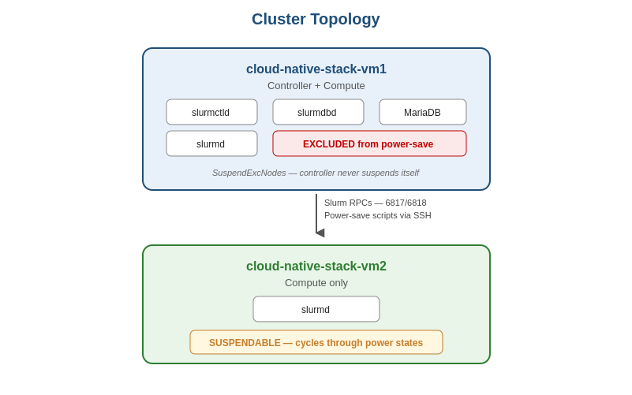

# Slurm Power-Save Lab — cloud-native-stack-vm1/vm2

A working, tested, and honestly-documented implementation of Slurm power-save
(suspend-on-idle / resume-on-demand) on a 2-node Fedora 44 lab cluster, with the
real-world findings and limits exposed by hands-on testing.

> **What you'll find here:** a complete design, working scripts, eight
> verification scenarios, an automated test suite — and the honest documentation
> of where ssh-stop-based power management hits architectural limits and why
> production deployments must use hypervisor/iDRAC APIs instead.

## Security note

This repo has been sanitized for public sharing:
- IP addresses removed — examples use hostnames; adjust to your environment
- Credentials are placeholders (`REPLACE_WITH_STRONG_PASSWORD`, `$IDRAC_PASS`)
- Never commit real secrets; source them from a secrets manager at runtime

## At a glance

| Item | Value |
|---|---|
| Cluster | cloud-native-stack-vm1 (controller + compute), cloud-native-stack-vm2 (compute) |
| OS | Red Hat Fedora 44 |
| Slurm | 24.05.2 |
| Feature | Power-save: suspend idle nodes, resume on demand |
| Use case | Foundation for cloud auto-scaling / cost control (XE9680 GPU cloud roadmap) |

## Contents

- [`docs/01-architecture.md`](docs/01-architecture.md) — high-level design and lifecycle
- [`docs/02-workflow.md`](docs/02-workflow.md) — build & test workflow
- [`docs/03-scenarios.md`](docs/03-scenarios.md) — the 8 verification scenarios
- [`docs/04-findings.md`](docs/04-findings.md) — what worked, what didn't, and why
- [`docs/05-production-mapping.md`](docs/05-production-mapping.md) — applying lessons to XE9680/iDRAC
- [`diagrams/`](diagrams/) — topology and lifecycle PNG diagrams
- [`configs/`](configs/) — slurm.conf excerpts, cgroup.conf, slurmdbd.conf
- [`scripts/`](scripts/) — suspend.sh, resume.sh (Level 1), verification suite

## Key technical findings

1. **The mechanism works** — auto-suspend on idle, controller exclusion, and
   resume-on-demand all validated end-to-end through Slurm's state machine and
   the `SuspendProgram`/`ResumeProgram` hooks.

2. **The ssh-stop backend is fragile** — using `ssh host systemctl stop slurmd`
   as a stand-in for real power management works for single cycles but desyncs
   Slurm's state machine on repeated cycles, leading to `down~` states.

3. **The architectural lesson** — Slurm's power-save assumes clean off/on
   semantics from the underlying platform. Production deployments need
   hypervisor-level (vSphere) or BMC-level (iDRAC/racadm) integration, not
   service-level SSH tricks.

4. **The recovery rule** — after a Level 1 suspend, always start `slurmd` on
   the target node *before* telling Slurm `state=idle`. Telling Slurm a node
   is idle while `slurmd` is genuinely stopped causes the controller to skip
   the resume code path entirely, leading to `ResumeTimeout` failures.

## Status

Phase 2 (power-save) — **substantively complete**. Mechanism proven, scripts
working, limitations understood and documented. Foundation ready for the
production version on Dell PowerEdge XE9680 hardware with iDRAC integration.
