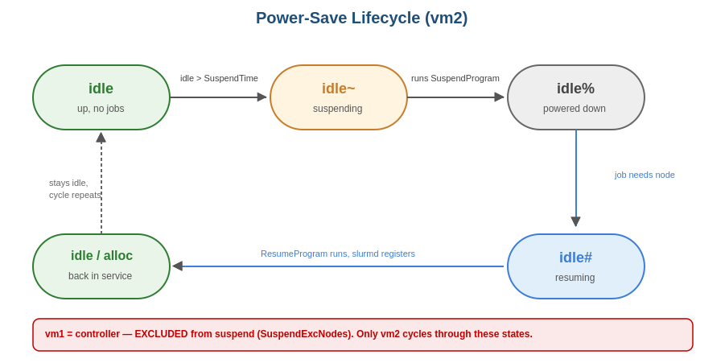

# 01 — Architecture & Design

## High-level architecture

Two Fedora 44 VMs, joined into a single Slurm cluster. Power-save is a Slurm
feature that lets the controller suspend idle compute nodes and resume them
when work arrives. It's the foundation of cloud auto-scaling — pay for what
you use, sleep what's idle.

## Why this design

Two roles, one cluster:

- **vm1 is the brain.** It runs `slurmctld` (the scheduler), the accounting
  database, and acts as a compute node. It's listed in `SuspendExcNodes` so
  power-save never targets it — suspending the controller would kill the
  cluster.

- **vm2 is the test subject.** It only runs `slurmd`. Power-save can suspend
  and resume it freely, which is what makes it the right node to test the
  cycle against without risking the cluster.

## The power-save lifecycle

vm2 cycles through five distinct states:

| State | Suffix | Meaning |
|---|---|---|
| `idle` | (none) | Node up, no jobs running. Normal. |
| `idle~` | `~` | Node has been suspended (power-save state). |
| `idle%` | `%` | Powered down (post-suspend, alternative version display). |
| `idle#` | `#` | In transition — usually resuming, slurmd starting back up. |
| `down~` | `down + ~` | Resume failed; Slurm gave up after `ResumeTimeout`. |

## Components

| Component | Role | Where |
|---|---|---|
| `slurmctld` | Scheduler; decides when to suspend/resume; calls scripts | vm1 |
| `slurmd` | Per-node agent; the thing being stopped/started | vm1 + vm2 |
| `slurmdbd` + MariaDB | Accounting/audit (records jobs, fair-share) | vm1 |
| `SuspendProgram` | Script called when a node should suspend | `/etc/slurm/suspend.sh` (vm1) |
| `ResumeProgram` | Script called when a suspended node needs to wake | `/etc/slurm/resume.sh` (vm1) |
| `/var/log/slurm/power.log` | Audit log written by the scripts | vm1 |

## Timing parameters

| Parameter | Value | Meaning |
|---|---|---|
| `SuspendTime` | 60 sec | Idle time before a node qualifies to suspend |
| `SuspendTimeout` | 60 sec | Max wait for `SuspendProgram` to complete |
| `ResumeTimeout` | 600 sec | Max wait for a resumed node to register again |
| `SuspendExcNodes` | `cloud-native-stack-vm1` | Never suspend the controller |

## Script levels

Two implementation approaches, both validated:

- **Log-only** — script writes to `power.log` but doesn't actually stop
  `slurmd`. Slurm's bookkeeping changes; vm2 itself doesn't change. Used to
  prove the mechanism safely.
- **Level 1 (ssh-stop)** — script SSHes to vm2 and stops/starts `slurmd`.
  Real effect, but architecturally fragile (see `04-findings.md`).
- **Production target (XE9680/iDRAC)** — script calls `racadm` or vSphere API
  to genuinely power-off/on the node. See `05-production-mapping.md`.
